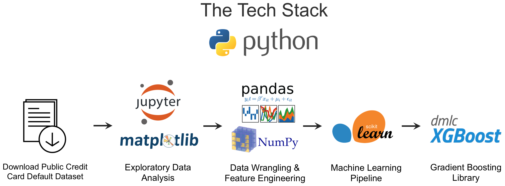

Predicting Credit Card Default with XGBoost
==============================

This repository contains the documentation for my first capstone project at [Springboard](https://www.springboard.com/workshops/data-science-career-track).  My project applies gradient boosting tree models to predict consumer credit card default.   Specifically, I used a high-performance implementation of the gradient boosting algorithm called XGBoost to predict credit card default.  

------------

Keywords:  Risk management; Machine learning; Gradient boosting; XGBoost

------------

## Table of Contents

[Background](#background)  
[Objective](#objective)  
[Process Overview and Tech Stack](#process-overview-and-tech-stack)   
[EDA and Data Mining](#eda-and-data-mining)  
[Method](#method)   
[Results](#results)   
[Next Steps](#next-steps)  
[References](#references)  
[Project Organization](#project-organization)  

------------

## Background

Machine learning techniques can be an important tool for financial risk management.  Performant and scalable machine learning models that are able to predict the probability of credit card default could bolster the risk management toolkits of credit scoring agencies and credit card originators.  

We trained and tested our gradient boosting model on the anonymized dataset of credit card holders used by Yeh & Lien (2009).  

...

------------

## Process Overview and Tech Stack

Below is a summary of the process steps and technology stack that I used in this project.

Below is a summary of the process steps which begins with data exploration and data munging. The model requires that the input be transformed into binary vectors which was done by parsing the csv in Python. Next, I used Apache Spark's implementation of MinHash LSH to take advantage of distributed computing to evaluate many parallel similarity calculations. The PySpark script was executed on an AWS virtual machine for additional computing power and resources. The output csv was uploaded to a Postgres database where it is available to be queried by users.

------------

Capstone Project: Using machine learning to predict the probability of default of credit card clients.

------------

## Project Organization

    ├── LICENSE
    ├── README.md          <- The top-level README for this project.
    ├── data
    │   ├── external       <- Data from third party sources.
    │   ├── processed      <- The final, canonical data sets for modeling.
    │   └── raw            <- The original, immutable data dump.
    │
    ├── models             <- Trained and serialized models, model predictions, or model summaries
    │
    ├── notebooks          <- Jupyter notebooks.
    │
    ├── reports            <- Generated analysis as HTML, PDF, LaTeX, etc.
    │   └── figures        <- Generated graphics and figures to be used in reporting
    │   └── images
    │
    └── src                <- Source code for use in this project.
        ├── __init__.py    <- Makes src a Python module
        │
        ├── data           <- Scripts to download or generate data
        │   └── make_dataset.py
        │
        ├── features       <- Scripts to turn raw data into features for modeling
        │   └── build_features.py
        │
        └── models         <- Scripts to train models and then use trained models to make
            │                 predictions
            ├── predict_model.py
            └── train_model.py

------------

## References

1. [Credit Card Default Data Set on the UCI Machine Learning Repository](https://archive.ics.uci.edu/ml/datasets/default%20of%20credit%20card%20clients)
2. [I-Cheng Yeh, and Che-Hui Lien. "The comparisons of data mining techniques for the predictive accuracy of probability of default of credit card clients." Expert Systems with Applications 36, no. 2 (2009)](https://pdfs.semanticscholar.org/1cac/ac4f0ea9fdff3cd88c151c94115a9fddcf33.pdf)

------------
